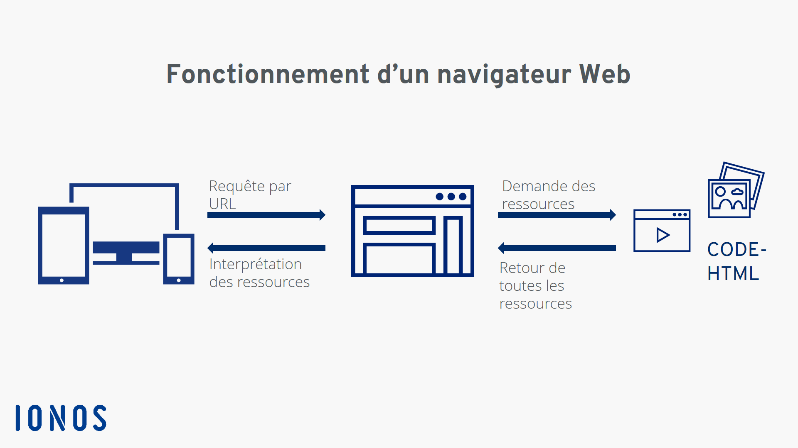

Chrome, Opera, FireFox, Microsoft Edge,Pourquoi existent-ils ?, Mais comment fonctionnent t'ils ?, Creons le notre 😌

### Navigateur web vs Moteur de recherche( la bataille dans les esprits)
D'après Wikipedia  _"Un navigateur web, navigateur Web1,2, fureteur2, est un logiciel conçu pour consulter et afficher le World Wide Web. Techniquement, c'est au minimum un client HTTP."_, et _"Un moteur de recherche est une application web permettant à un utilisateur d'effectuer une recherche en ligne (ou recherche internet), c'est-à-dire de trouver des ressources à partir d'une requête composée de termes"_. 


En résumé un Navigateur web permet d'acceder aux pages web et le moteur de recherche est un aggregateur de page web c'est à dire rassemble les sites web et les rends accessible a partir d'une recherche par mot clé.

### Fonctionnement 
2 etapes  : 
  - Le client (Navigateur) envoie l'url au serveur 
  - Le serveur retourne une page web


### Realisation du Projet 

Pour la realisation nous avons utilisé ElectronJS.

ElectronJS est un framework opensource dedié à la creation des applications pour ordinateurs en utilisant les technologies du web.
Organisation de notre projet : 


- le fichier electronbrowser.js permet d'evaluer les evenements evenements de la fenetre et de faire les actions requises pour chaque evenement. Son contenu est le suivant : 

```vue
//Initializing the components
var ById = function (id) {
    return document.getElementById(id);
}

var path = require('path');
var uuid = require('uuid');
var jsonfile = require('jsonfile');
var bookmarks = path.join(__dirname, 'bookmarks.json');
var bookmarkspage = path.join(__dirname, 'bookmarks.html');
var tirexGame = path.join(__dirname, 'tirex.html');

var back = ById('back'),
    forward = ById('forward'),
    refresh = ById('refresh'),
    omni = ById('omnibox1'),
    dev = ById('console'),
    fave = ById('fave'),
    list = ById('list'),
    homes = ById('homes'),
    view = ById('view');


//Navigation Functions
function reloadView () {
    view.reload();
}

function backView () {
    view.goBack();
}

function forwardView () {
    view.goForward();
}

function homeView () {
    view.loadURL('https://www.bing.com/');
}


//Load URL from the textbox
function updateURL (event) {
    if (event.keyCode === 13) {
        omni.blur();
        let val = omni.value;
        let https = val.slice(0, 8).toLowerCase();
        let http = val.slice(0, 7).toLowerCase();
        if (https === 'https://') {
            view.loadURL(val);

        } else if (http === 'http://') {
            view.loadURL(val);
        } else {
            view.loadURL('http://'+ val);
        }
    }
}


//Loading Status
function loadstart (event) {
    omni.value = "  Loading...";
    omni.style.backgroundColor = "#fff";
}

//Show URL of the web page
function updateNav (event) {
    omni.value = "  " + view.src;
}

//Load DevTools
function handleDevtools () {

    if (view.isDevToolsOpened()) {
        view.closeDevTools();
    } else {
        view.openDevTools();
    }
}

//Add a bookmark
var Bookmark = function (id, url, faviconUrl, title) {
    this.id = id;
    this.url = url;
    this.icon = faviconUrl;
    this.title = title;
}

function addBookmark () {
    let url = view.src;
    let title = view.getTitle();
    let fav1 = "https://s2.googleusercontent.com/s2/favicons?domain_url=" + url
    let booktag = new Bookmark(uuid.v1(), url, fav1, title);
    jsonfile.readFile(bookmarks, function(err, books) {
        books.push(booktag);
        jsonfile.writeFile(bookmarks, books, function (err) {

        });
    });

}

//Go to Bookmarks page
function gotoBookmarks () {
    view.loadURL(bookmarkspage);
}

//Load Tirex game when failed to load
function gotoGame () {
    view.loadURL(tirexGame);
}

//Event Listeners
refresh.addEventListener('click', reloadView);
back.addEventListener('click', backView);
forward.addEventListener('click', forwardView);
omni.addEventListener('keydown', updateURL);
view.addEventListener('did-start-loading', loadstart)
view.addEventListener('did-finish-load', updateNav);
view.addEventListener('did-fail-load', gotoGame);
homes.addEventListener('click', homeView);
fave.addEventListener('click', addBookmark);
list.addEventListener('click', gotoBookmarks);
dev.addEventListener('click', handleDevtools);


</script>
```
- L'interface est fait en HTML et CSS : 

```vue
<!doctype html>

<html lang="en">
    <head>
        <meta charset="utf-8">
        <meta http-equiv="X-UA-Compatible" content="IE=edge">
        <meta name="description" content="A front-end template that helps you build fast, modern mobile web apps.">
        <meta name="viewport" content="width=device-width, initial-scale=1.0, minimum-scale=1.0">
        <title>S-Browser</title>

        <link rel="stylesheet" href="https://fonts.googleapis.com/css?family=Roboto:regular,bold,italic,thin,light,bolditalic,black,medium&amp;lang=en">
        <link rel="stylesheet" href="node_modules/material-design-icons/iconfont/material-icons.css">
        <link rel="stylesheet" href="css/material.min.css">
        <link rel="stylesheet" href="css/main.css">
    </head>
    <body>
        <div class="demo-layout mdl-layout mdl-js-layout mdl-layout--fixed-header">
            <header class="demo-header mdl-layout__header mdl-color--grey-100 mdl-color-text--grey-600">
                <div class="mdl-grid pihatu-grid">
                    <div class="mdl-cell mdl-cell--1-col button-size">
                        <button id="back" class="mdl-button mdl-js-button mdl-button--icon mdl-js-ripple-effect">
                            <i class="material-icons">keyboard_arrow_left</i>
                        </button>
                    </div>
                    <div id="forward" class="mdl-cell mdl-cell--1-col button-size">
                        <button class="mdl-button mdl-js-button mdl-button--icon mdl-js-ripple-effect">
                            <i class="material-icons">keyboard_arrow_right</i>
                        </button>
                    </div>
                    <div id="refresh" class="mdl-cell mdl-cell--1-col button-size">
                        <button class="mdl-button mdl-js-button mdl-button--icon mdl-js-ripple-effect">
                            <i class="material-icons">refresh</i>
                        </button>
                    </div>
                    <div id="homes" class="mdl-cell mdl-cell--1-col button-size">
                        <button class="mdl-button mdl-js-button mdl-button--icon mdl-js-ripple-effect">
                            <i class="material-icons">home</i>
                        </button>
                    </div>
                    <div class="mdl-cell mdl-cell--6-col omnibox-size">
                        <input class="mdl-textfield__input" type="text" id="omnibox1">
                    </div>
                    <div id="fave" class="mdl-cell mdl-cell--1-col button-size">
                        <button id='search' class="mdl-button mdl-js-button mdl-button--icon mdl-js-ripple-effect">
                            <i class="material-icons">search</i>
                        </button>
                    </div>

                  
                  
                    <div class="mdl-cell mdl-cell--1-col button-size">
                        <button class="mdl-button mdl-js-button mdl-js-ripple-effect mdl-button--icon" id="hdrbtn">
                            <i class="material-icons">more_vert</i>
                        </button>
                        <ul class="mdl-menu mdl-js-menu mdl-js-ripple-effect mdl-menu--bottom-right" for="hdrbtn">
                            <li id="console" class="mdl-menu__item">DevTools</li>
                            <li id="list" class="mdl-menu__item">Bookmarks</li>
                        </ul>
                    </div>
                </div>
            </header>

            <main id="mains" class="mdl-layout__content">
                <div id="views" class="page-content">
                    <webview id="view" class="page" src="https://www.bing.com/" autosize="on"></webview>
                </div>
            </main>
        </div>
        <script src="js/material.min.js"></script>
        <script>
            
            require('./electronbrowser.js')
        </script>
    </body>
</html>

```

#### Resultats


